### Hello World, I'm Mahdi, Data Scientist | MLOps | Computational Physicist (Ph.D.)! 👋

- Data scientist and machine learning developer with over 10 years of experience in data science.
- Expert in Python, C++, with a solid foundation in physics, mathematics, and statistics.
- Expert in developing XAI modules to enhance decision-making transparency of black-box models for images and timeseries.
- Developer of the Open-Source Python Package (TelescopeML).
- Lead developer of XAI module for TelescopeML (PyPI). 
- Developer of end-to-end AI/ML/DL projects, collaborating with cross-functional teams.
- Developer of a novel suppression model and particle-in-cell simulation module for emission flux.
---

<h3 align="left">Connect with me:</h3>

---

### 🏅 My Professional Badges

  <a href="https://www.credly.com/badges/bc43b40a-eef4-4f7a-8f9d-ed97f8b4419e/public_url">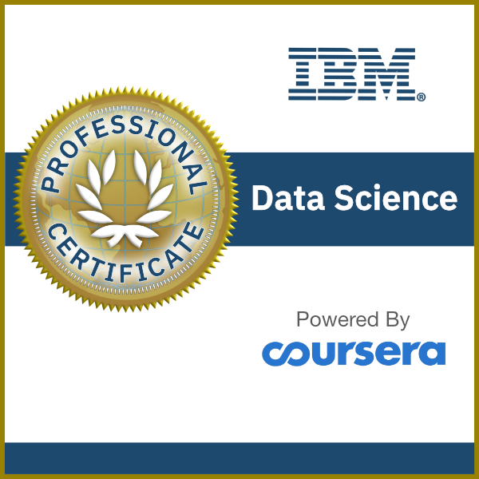</a>
  <a href="https://www.credly.com/badges/7ea6a665-c975-468c-a385-b84c8dfcb485/public_url">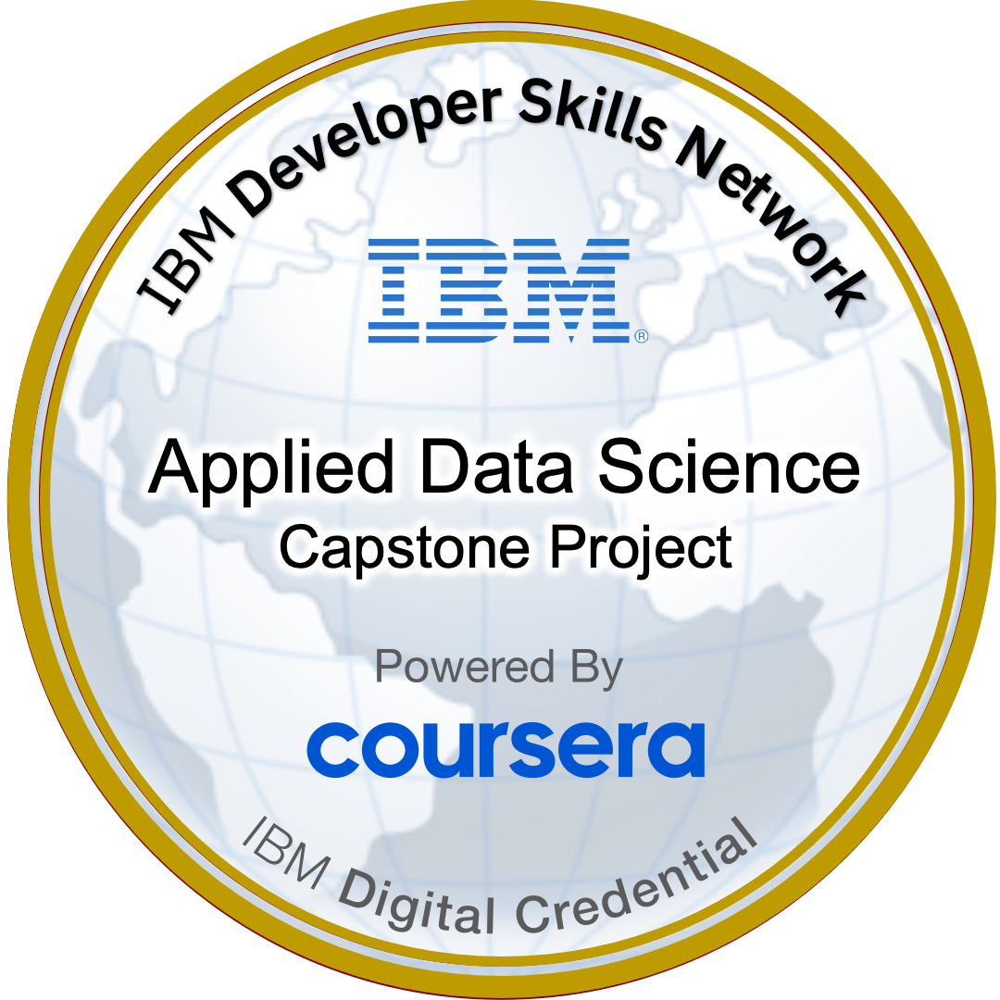</a>
  <!--<a href="https://www.credly.com/badges/fe0dc299-dd44-416d-827f-be2bfb5d4ac1/public_url">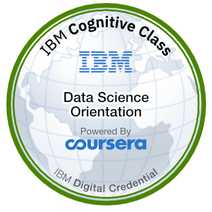</a>-->
  <!--<a href="https://www.credly.com/badges/517ed3bd-99e0-4e06-a71a-7b4c608b38bb/public_url">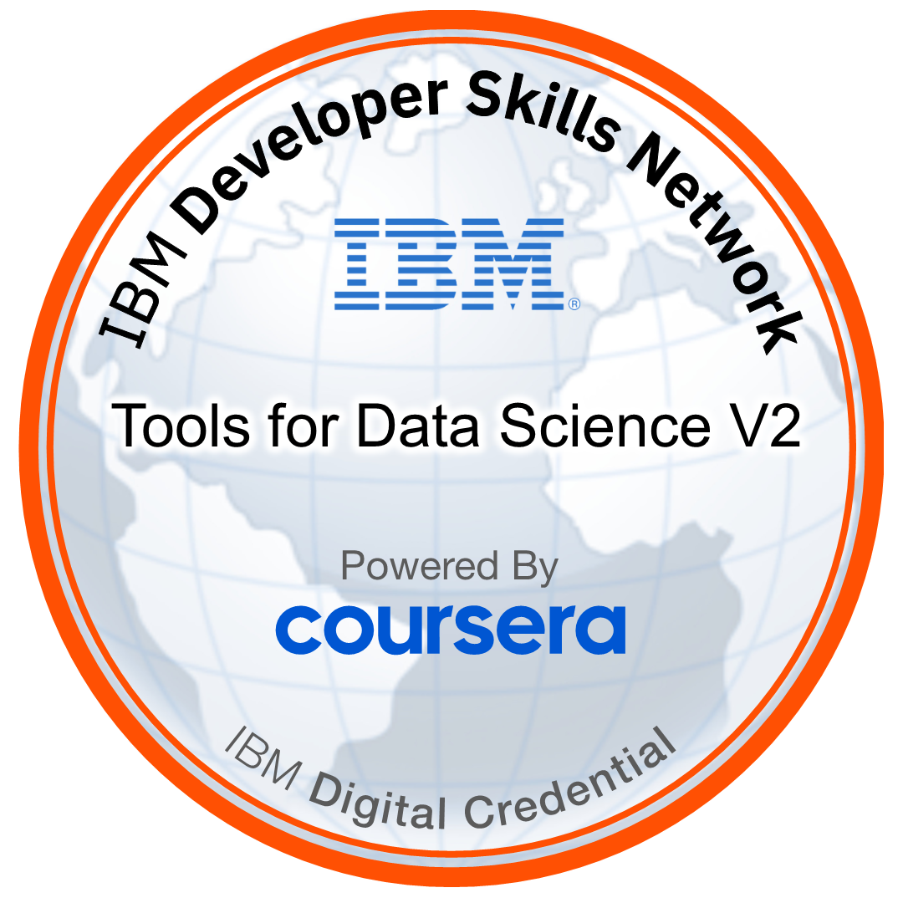</a>-->
  <!---->
  <!--<a href="https://www.credly.com/badges/81761b38-53d2-4f47-8dee-42dc1a9af259/public_url">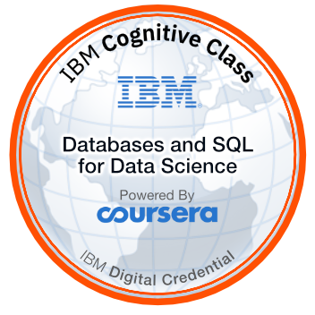</a>-->
  <!--<a href="https://www.credly.com/badges/477bb76c-b576-45df-80d0-786e5f52e0b2/public_url">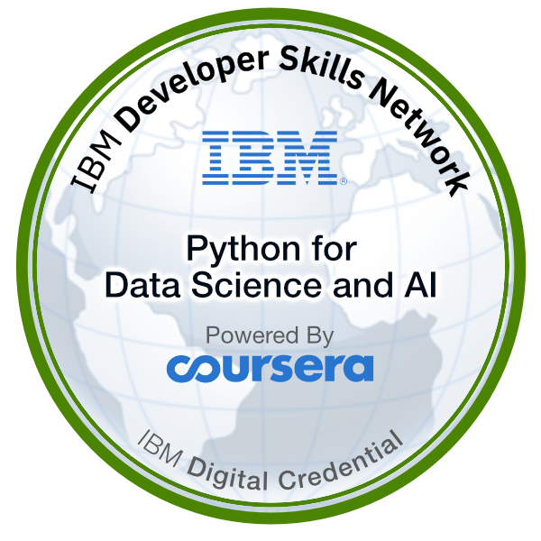</a>-->
  <!---->
  <!---->
  <!--<a href="https://www.credly.com/badges/7ccde3f1-f520-4186-87b3-b68ba1334d9a/public_url">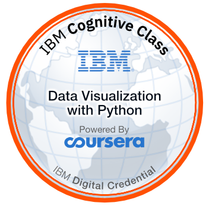</a>-->
  
  

---
<h3 align="left">Skills:</h3>

                    

&nbsp;

---

### Projects

<table>
  <tr>
    <th>Projects</th>
    <th>Techniques</th>
    <th>Data Types</th>
    <th>Poster</th>
  </tr>
  <tr>
    <td>
      <a href="https://github.com/EhsanGharibNezhad/TelescopeML.git"><strong>TelescopeML Open-Source Python Package</strong></a> 
      <em>Deep Convolutional Neural Networks and Machine Learning Models for Analyzing Stellar and Exoplanetary Telescope Spectra</em>
    </td>
    <td>Deep CNN, Machine Learning, XAI, LIME</td>
    <td>Timeseries, Tabular</td>
    <td>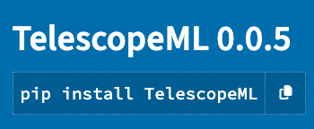</td>
  </tr>
  <tr>
    <td>
      <a href="https://github.com/mdhabibi/CNN-Predictor-for-Malaria_Cells-LIME-CAM.git"><strong>Malaria Cell Classifier</strong></a> 
      <em>Deep Convolutional Neural Networks and Machine Learning Models for Anomaly Detection in Microscopic Malaria cells.</em>
    </td>
    <td>Deep CNN, Data Augmentation, Feature Engineering, Image Processing, Optimization</td>
    <td>Image</td>
    <td>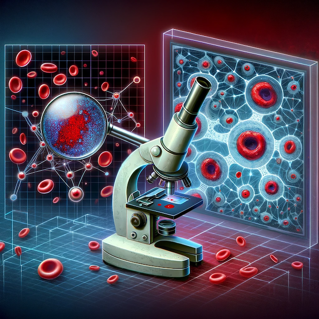</td>
  </tr>
  <tr>
    <td>
      <a href="https://github.com/mdhabibi/CNN-Predictor-for-Malaria_Cells-LIME-CAM.git"><strong>BloodPy-Automated Blood Cell Classifier</strong></a> 
      <em>Multi-Classification of Peripheral Blood Cells using Deep Convolutional Neural Networks and Machine Learning Models.</em>
    </td>
    <td>Deep CNN, Data Augmentation, Transfer Learning, U-Net, Image Processing, Statistical Analysis, OpenCV, Fine-tuning</td>
    <td>Image, Metadata</td>
    <td></td>
  </tr>
     <tr>
    <td>
      <a href="https://www.kaggle.com/datasets/mahdihabibi/segmented-peripheral-blood-cells-using-opencv"><strong>Dataset: Segmented Peripheral Blood Cells Using OpenCV</strong></a> 
      <em>A Dataset of Segmented White Blood Cell Images Using Advanced Image Processing Techniques.</em>
    </td>
    <td>GrabCut, Morphological Operations, OpenCV</td>
    <td>Image, Binary Masks, Dataset</td>
    <td></td>
  </tr>
    <tr>
    <td>
      <a href="https://github.com/mdhabibi/CNN-Predictor-for-Malaria_Cells-LIME-CAM/blob/a92f31337892b74239f7392dab45d17f34326e58/Notebooks/LIME_test.ipynb"><strong>LIME for Macroscopic Medical Images</strong></a> 
      <em>A Surrogate Model (Local Interpretable Model-agnostic Explanations) for Enhancing Transparency of Medical Diagnostics.</em>
    </td>
    <td>Deep CNN, LIME, XAI, Computer Vision, Optimization</td>
    <td>Image</td>
    <td>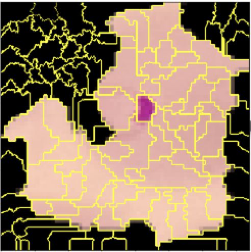</td>
  </tr>
    <tr>
    <td>
      <a href="https://github.com/mdhabibi/CNN-Predictor-for-Malaria_Cells-LIME-CAM/blob/a92f31337892b74239f7392dab45d17f34326e58/Notebooks/CAM_test.ipynb"><strong>CAM for Macroscopic Medical Images</strong></a> 
      <em>Class Activation Mapping (CAM) Technique for Anomaly Localization Interpretability.</em>
    </td>
    <td>Deep CNN, CAM, XAI, Computer Vision, Data Analysis, Optimization</td>
    <td>Image</td>
    <td>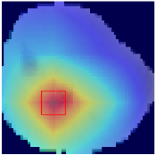</td>
  </tr>
  <tr>
    <td>
      <a href="https://github.com/mdhabibi/Automated-Cell-Semantic-Segmentation-with-UNet.git"><strong>Automated Nucleus Detectior</strong></a> 
      <em>A Semantic Segmentation Solution for Automating Nucleus Detection of Microscopic Biomedical Images.</em>
    </td>
    <td>U-Net, Keras-tunner, Semantic Segmentation</td>
    <td>Image</td>
    <td></td>
  </tr>
  <tr>
    <td>
      <a href="https://github.com/mdhabibi/Neural-Compression-with-Autoencoders.git"><strong>Neural Compression</strong></a> 
      <em>Advanced Autoencoder Architecture for Efficient Data Compression Losslessly.</em>
    </td>
    <td>Autoencoder, GenAI, SSIM, PSNR</td>
    <td>Image</td>
    <td></td>
  </tr>
  <tr>
    <td>
      <a href="https://github.com/mdhabibi/LIME-for-Time-Series.git"><strong>LIME for ECG Classification</strong></a> 
      <em>A Surrogate Model (Local Interpretable Model-agnostic Explanations) for Enhancing Transparency of TimeSeries.</em>
    </td>
    <td>CNN, LIME, Time Series Analysis</td>
    <td>Timeseries</td>
    <td></td>
  </tr>
  <tr>
    <td>
      <a href="https://github.com/mdhabibi/DeepLearning-VAE.git"><strong>Beta-Variational Autoencoders</strong></a> 
      <em>Generative Learning (GenAI) with Beta-Variational Autoencoders.</em>
    </td>
    <td>Beta-VAEs, Latent Space Analysis</td>
    <td>Image</td>
    <td>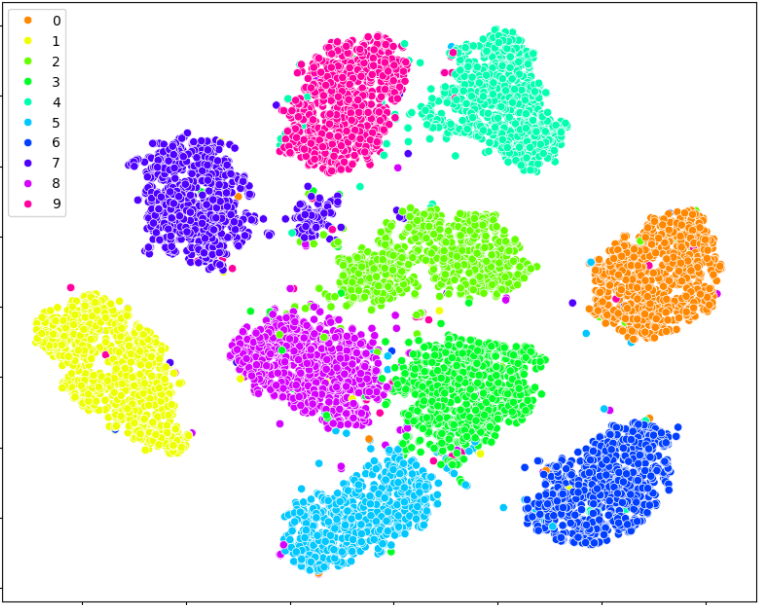</td>
  </tr>
  <tr>
    <td>
      <a href="https://github.com/mdhabibi/Capstone-Project-IBM.git"><strong>Falcon 9 rocket Predictor</strong></a> 
      <em>A Data-Driven Project to Predict the Success of Falcon 9 Rocket Landings.</em>
    </td>
    <td>Data Wrangling, Feature Engineering, Web-Scraping, JSON Data Processing, SQL, Hadoop, Folium, Decision Tree Classification</td>
    <td>Unstructured Data, Tabular, Database</td>
    <td></td>
  </tr>
  <tr>
    <td>
      <a href="https://github.com/mdhabibi/Variational_AutoEncoders.git"><strong>Variational AutoEncoders</strong></a> 
      <em>A collection of Variational AutoEncoder (VAE) architectures developed by Keras deep learning framework.</em>
    </td>
    <td>Variational AutoEncoders, Exploratory Data Analysis (EDA)</td>
    <td>Image</td>
    <td>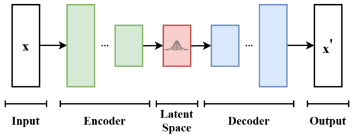</td>
  </tr>
  <tr>
    <td>
      <a href="https://www.kaggle.com/code/mahdihabibi/netflix-content-analysis"><strong>Netflix Content Analysis</strong></a> 
      <em>An Exploratory Analysis of Netflix's Vast Catalog to Uncover Trends and Insights into Content Distribution, Popularity, Quality, and Key Contributors.</em>
    </td>
    <td>Exploratory Data Analysis (EDA), Data Visualization, Statistical Analysis</td>
    <td>Metadata</td>
    <td>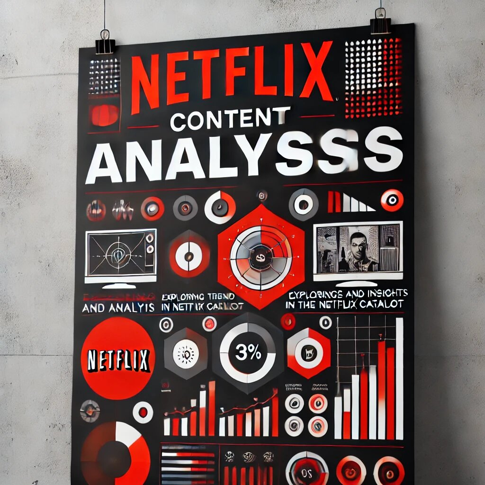</td>
  </tr>
  <tr>
    <td>
      <a href="https://www.kaggle.com/code/mahdihabibi/air-passenger-time-series-analysis-1"><strong>Air Passenger Timeseries Analysis</strong></a> 
      <em>An Exploratory Analysis of the Air Passengers Timeseries dataset, Uncovering Trends and Patterns in Air Travel Over the Years.</em>
    </td>
    <td>Timeseries Analysis, Log Transformation, Moving Averages, Seasonal Decomposition, Seasonal Adjustment</td>
    <td>Timeseries</td>
    <td>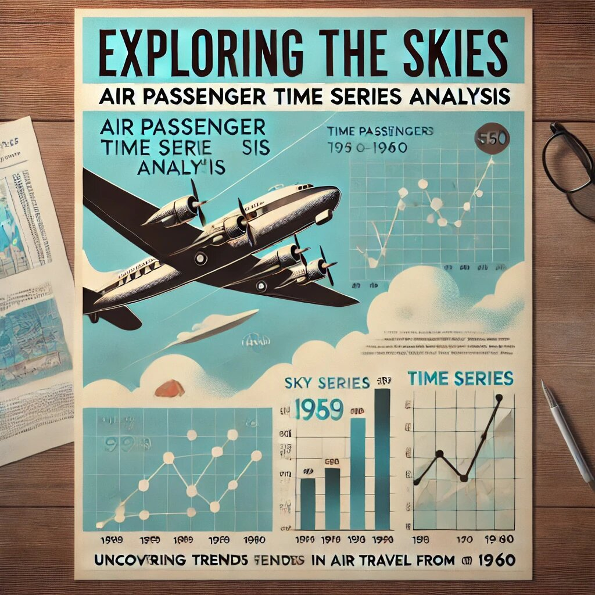</td>
  </tr>
</table>

