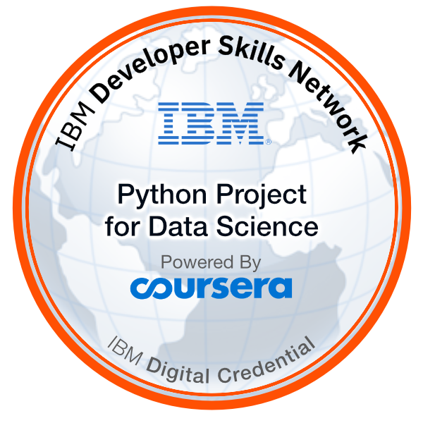

### Hello World, I'm Mahdi, a computational physicist! 👋
- 🔭 I finished successfully my Ph.D. study with a "Magna Cum Laude" grade. 😄
- 🌱 I’m currently working on a neural compression concept in deep learning algorithms. 
- 👯 I’m looking to collaborate on open-source ML&DL projects.
- 🤔 I’m seeking a job in data science and machine learning projects.
- 💬 Ask me about ... Soft Skills ...
- 📫 How to reach me: ... [LinkedIn](https://www.linkedin.com/in/mahdi-habibi/)
- 😄 Pronouns: ...He/Him
- ⚡ Fun fact: ...I am very HAPPY when everyone is HAPPY ;-)

---

### 🏅 My Professional Badges

  
  
  
  
  
  
  
  
  
  
  

